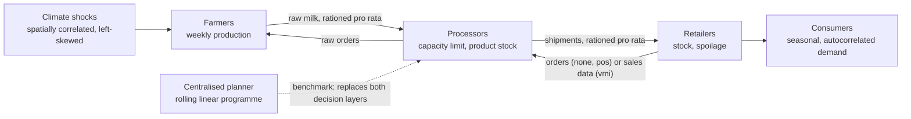
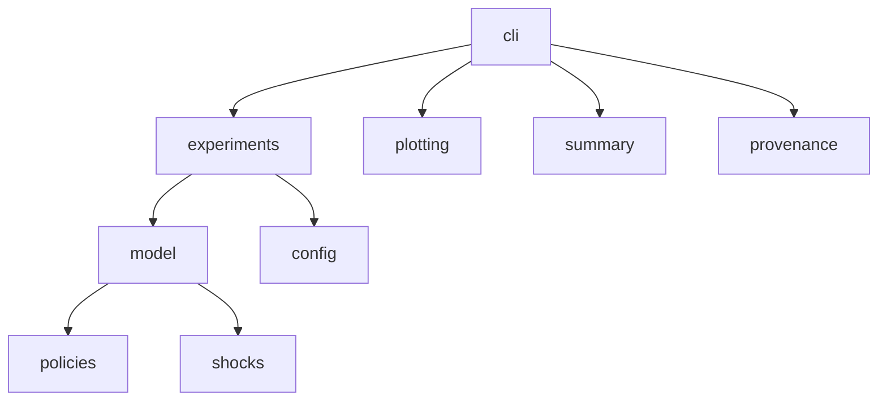

# Architecture

```mermaid
flowchart LR
    CL["Climate shocks<br/>spatially correlated, left-skewed"] --> F["Farmers<br/>weekly production"]
    F -->|"raw milk, rationed pro rata"| P["Processors<br/>capacity limit, product stock"]
    P -->|"shipments, rationed pro rata"| R["Retailers<br/>stock, spoilage"]
    R --> C["Consumers<br/>seasonal, autocorrelated demand"]
    R -->|"orders (none, pos) or sales data (vmi)"| P
    P -->|"raw orders"| F
    PL["Centralised planner<br/>rolling linear programme"] -.->|"benchmark: replaces both decision layers"| P
```

## Module dependencies (`src/afabm/`)

```mermaid
flowchart TD
    cli --> experiments
    cli --> plotting
    cli --> summary
    cli --> provenance
    experiments --> model
    experiments --> config
    model --> policies
    model --> shocks
```
